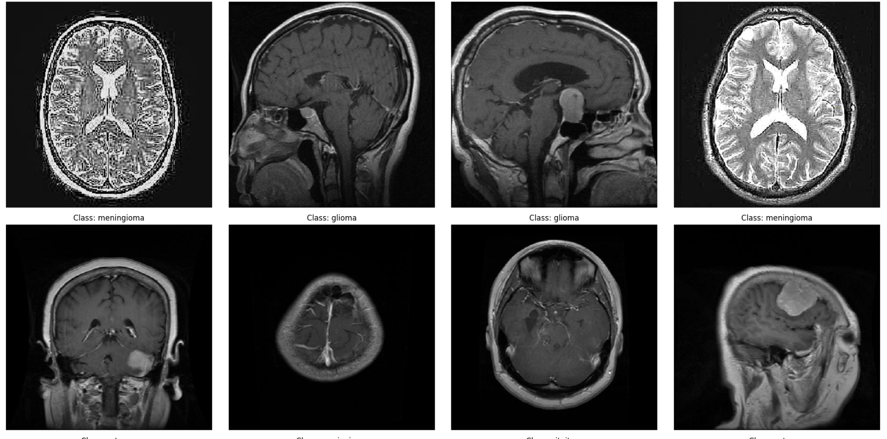

# 🧠 Brain Tumor Classification Model

  
*A deep learning model for detecting brain tumors from MRI scans.*

## 🚀 Overview
This project leverages deep learning techniques to classify brain tumors from MRI images. Using Convolutional Neural Networks (CNNs), the model predicts whether an MRI scan indicates a tumor or not.

## 📌 Features
- Pretrained model using **TensorFlow/Keras**
- **Image preprocessing** with OpenCV & PIL
- **Augmentation** to improve model robustness
- **CNN architecture** for classification
- Performance evaluation with **accuracy & confusion matrix**

## 🔬 Technologies Used
- 🐍 Python
- 🧠 TensorFlow, Keras
- 📊 NumPy, Pandas, Matplotlib
- 📷 OpenCV, PIL

## 📊 Model Performance
```
              precision    recall  f1-score   support

           0       0.91      0.85      0.88       150
           1       0.83      0.85      0.84       153
           2       0.97      0.97      0.97       203
           3       0.95      0.99      0.97       150

    accuracy                           0.92       656
   macro avg       0.92      0.92      0.92       656
weighted avg       0.92      0.92      0.92       656
```

## 🤝 Contributing
Feel free to open an issue or submit a pull request to improve the project!

## 📜 License
This project is licensed under the MIT License.

## 🔗 Connect with Me
[](https://linkedin.com/in/amanhiranpurohit)  
